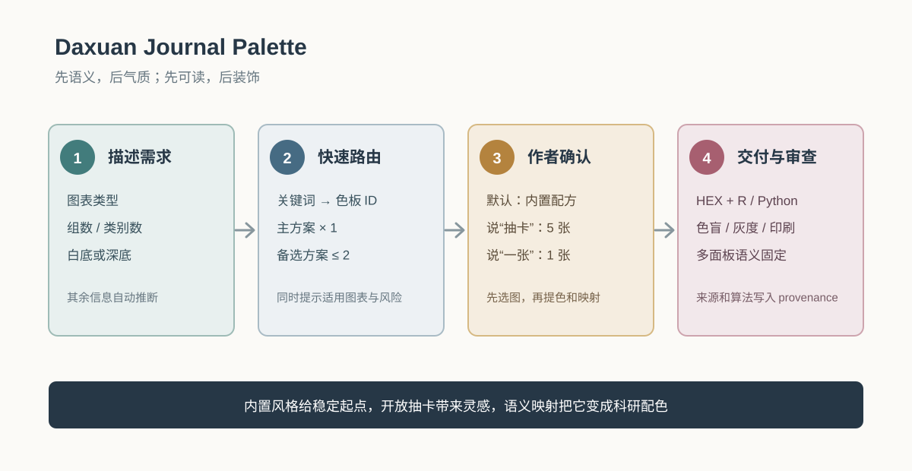
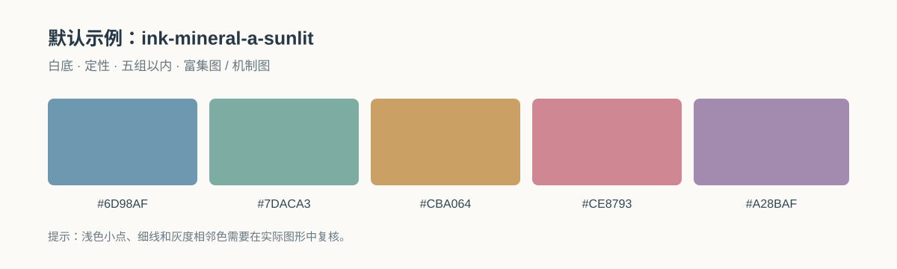

# Daxuan Journal Palette

一个面向科研论文图表的配色 Skill：把图表语义、作者审美和出版可读性连接起来，输出可复用的 HEX、R/ggplot2、Python 映射以及色盲、灰度、印刷和多面板一致性审查。当前版本为 0.5.3。

## 科研作者为什么总觉得配色难

科研配色的困难，通常不是“找不到好看的颜色”，而是下面几件事同时发生：

- **数据有语义**：分类、连续强度、正负方向和中性背景不能用同一种配色逻辑。
- **投稿会缩小**：屏幕上漂亮的浅色，到了单栏、PDF、灰度或印刷版本里可能失去层次。
- **图会变复杂**：组数一多、分面一多、图例一多，相近颜色就会互相争夺注意力。
- **审美要能复用**：作者希望图有自己的气质，但同一篇论文中的主图、补充图和后续项目仍要保持一致。
- **选择要说得清**：颜色为什么这样分配、哪些是设计判断、哪些经过检查，最好都能留下记录。

所以，这个 Skill 不把配色理解成“挑五个漂亮的 HEX”。它先给数据安排视觉角色，再给角色选择艺术语汇，最后在真实图形和目标尺寸上检查可读性。这里的 **taste** 不是追求装饰感，而是让重要结果先被看到，让同一语义在不同图中保持同一种颜色，并让整套图看起来克制、有层次、能解释、能复用。

## Prerequisites

- [ ] Python 3.10+（仅用于生成静态画廊）
- [ ] Pillow（仅在需要从本地图像自动提色时需要；可改用人工取色）
- [ ] R 或 Python 绘图环境（仅在实际绘图时需要）
- [ ] 已确定图表类型、类别顺序、目标栏宽和输出介质

开放公共领域抽卡需要网络；内置色板、静态画廊和生成式卡片提示不依赖网络。

## 30 秒开始



只需提供三个信息：**图表类型、组数/类别数、白底或深底**。Skill 会先返回 1 套主方案和最多 2 套备选，并说明适用图表与风险；只有你明确说“抽卡”或“从图片提色”时，才进入图像流程。

| 你的困境或目标 | 直接这样说 | 默认行为 |
|---|---|---|
| 快速得到可投稿方案 | “五组白底 GO 富集图，东方水墨风格” | 内置路由，返回 1+2 套方案 |
| 比较几种审美 | “比较宋韵、敦煌和北欧矿物，适合白底多面板” | 先比较风格，再给主方案 |
| 开放探索 | “随机抽 5 张蓝绿色公共领域作品” | 抽 5 张，先选图再提色 |
| 只看一个灵感 | “随机一张现代水墨视觉卡片” | 只生成/返回 1 张 |
| 审查已有配色 | “审查这张热图的连续色带和灰度风险” | 保留数据语义，检查可读性 |
| 颜色好看但组间读不清 | “保留这种气质，拉开五组颜色的明度和灰度差异” | 同一家族内优先修正明度 |
| 不同分面中的同一通路变了颜色 | “固定所有分面中同一通路的颜色，并给我 R/Python 映射” | 建立全局语义映射 |

### 默认白底示例



这套 `ink-mineral-a-sunlit` 是白底五组以内的默认起点。它不是期刊官方色板，也不是历史颜色复原；最终仍需结合图形尺寸、灰度和输出介质审查。

## 你可以直接这样说

- “给 GO-BP 富集图设计中国水墨加矿物色，输出 HEX 和 ggplot2 映射。”
- “给五组科研柱状图选不太浅、适合期刊投稿的高级配色，检查色盲和灰度。”
- “比较宋韵、敦煌矿物和北欧矿物三种论文配色，告诉我哪一种适合白底多面板图。”
- “把水墨、文人纸本、青花瓷、草木土色、海岸矿物和现代编辑部风格列成风格地图，给出适用图形和风险。”
- “审查这张热图的连续色带和中点设置，给出印刷和最终尺寸风险。”
- “把所有分面中同一通路固定为同一种颜色，并生成 R 和 Python 代码。”
- “在内置风格之外，随机抽 5 张公共领域的蓝绿色作品，让我选一张，再提取配色做 GO 富集图。”
- “生成 5 张没有文字的现代水墨视觉卡片，我选一张后，把它转成适合白底论文图的 5 色方案。”

## 输出

默认给一套主方案和不超过两套备选方案。每套方案都回答四个问题：**它服务什么数据语义、为什么有这种气质、在什么投稿场景下稳妥、最需要检查什么风险**。随后才给出精确 HEX、文字/背景/描边建议、R/ggplot2 与 Python 示例、可访问性检查、假设和来源记录。风格总表见 [references/style-taxonomy.md](references/style-taxonomy.md)，具体配方见 [references/palette-atlas.md](references/palette-atlas.md)。需要直观看颜色时，打开 [assets/palette-gallery/index.html](assets/palette-gallery/index.html) 或 [assets/palette-gallery/palette-atlas.svg](assets/palette-gallery/palette-atlas.svg)。

当前用户选定的 A 风格经过白底和缩印优化，默认使用 `ink-mineral-a-sunlit`：

```text
#6D98AF  #7DACA3  #CBA064  #CE8793  #A28BAF
```

它适合白底的富集图、机制图和五组以内的定性分类。它是设计色板，不是历史色彩复原；较深的 `ink-mineral-a` 仍可用于深色底图或需要更强重量感的图。

快速路由只读取轻量索引；完整 HEX 配方、艺术来源和审查细节按需展开。命令行可以用 `--compact` 获取简短结果，用 `--limit 1` 只保留主方案：

```bash
python3 scripts/route_palette.py "五组白底 GO 富集图，东方水墨风格" --compact
```

典型的紧凑结果是：

```text
模式：fast-built-in
主方案：ink-mineral-a-sunlit
备选：dunhuang-mineral、hokusai-indigo
类型：qualitative；组数：5；背景：white
下一步只需确认：图表类型、组数、白底/深底
```

可用的艺术家族包括：水墨矿物、文人纸本、江南烟雨、宋韵青瓷、青花瓷、敦煌矿物、朱砂宫墙、草木土色、茶褐植物、北欧矿物、海岸矿物、沙漠陶土、高山湖泊、现代编辑部、临床冷暖、石墨铜色、单色强调、柔和补充图，以及印象派大气、梵高式强调、马蒂斯式平面、Rothko 式色域、浮世绘靛蓝和现代水墨矿物。它们是视觉设计标签，不代表任何期刊官方色板或历史色彩复原。艺术来源和公开仓库见 [references/artistic-inspiration.md](references/artistic-inspiration.md)。

画廊由 [scripts/build_palette_gallery.py](scripts/build_palette_gallery.py) 从 `palettes.json` 生成。HTML 用于筛选和复制，SVG 用于矢量查看，CSV 用于 R/Python 整理；灰度代理仅用于快速发现明度风险。

如果内置风格不够开放，可以使用 [开放抽卡工作流](references/card-draw-workflow.md)：用 [scripts/draw_art_cards.py](scripts/draw_art_cards.py) 抽取公共领域候选图，用 [scripts/extract_palette.py](scripts/extract_palette.py) 提取候选色，或调用本机 `imagegen` 生成 3–5 张视觉卡片。必须先让作者选图，再做语义映射和实际图形审查；抽卡来源、生成 prompt、版权状态和提色方法都要进入 `provenance`。

普通请求先走 [快速路由索引](assets/palette-gallery/palette-index.json)，使用 `scripts/route_palette.py` 返回 1 套主方案和最多 2 套备选；只有用户明确提出抽卡或图片提色时才进入图像流程。默认只追问图表类型、组数和白底/深底。

快速路由示例：

```bash
python3 scripts/route_palette.py "五组白底 GO 富集图，东方水墨风格"
python3 scripts/route_palette.py "随机抽一张蓝绿色公共领域作品"
```

仓库包含 MIT LICENSE 和 GitHub Actions 校验，可作为 public GitHub skill 发布；具体发布和版本标签顺序见 [references/github-publishing.md](references/github-publishing.md)。

## 图片、画廊与公开来源

| 资源 | 用途 |
|---|---|
| [快速使用流程图](assets/quickstart/usage-flow.svg) | 查看“需求 → 路由 → 确认 → 交付”的基本理念 |
| [默认白底色板图](assets/quickstart/default-palette.svg) | 直观看到默认五色，而不是只看 HEX |
| [交互式画廊](assets/palette-gallery/index.html) | 按风格、图表类型和关键词筛选，复制色板 ID |
| [SVG 色板总览](assets/palette-gallery/palette-atlas.svg) | 适合浏览、打印和矢量编辑 |
| [CSV 色板表](assets/palette-gallery/palettes.csv) | 供 R/Python 或表格工具继续整理 |
| [快速路由索引](assets/palette-gallery/palette-index.json) | 查看关键词、色板 ID、适用图表和风险 |
| [艺术灵感与公开仓库](references/artistic-inspiration.md) | MetBrewer、scico、accessible-color-cycles、PNWColors 等 |
| [开放抽卡工作流](references/card-draw-workflow.md) | 公共领域、生成式和混合抽卡的完整步骤 |

可进一步浏览的公开来源：[The Met Open Access API](https://metmuseum.github.io/)、[National Gallery of Art Open Access](https://www.nga.gov/artworks/free-images-and-open-access)、[Rijksmuseum Data Services](https://data.rijksmuseum.nl/)、[Art Institute of Chicago API](https://api.artic.edu/docs/)、[Color for geoscience](https://dominicroye.github.io/color-for-geoscience/) 和 [SciPalette](https://scipalette.fantasticjoe.com/)。使用外部图像时，保留对象页、权利状态、提色算法和调整记录。

## 使用边界

本 Skill 负责色彩方案和图形可读性审查，不负责统计检验、数据清洗、期刊投稿保证、品牌识别、网页 UI 主题或照片调色。色盲/灰度检查只能说明当前图形在给定尺寸和导出格式下的风险，不能替代人工查看。

可选地结合本机 `easyplot` 的 palette audit、`nature-figure` 的图形契约和 `journal-ggplot-stylebook` 的期刊导出规则；这些依赖不由本 Skill 自动安装。自动诊断只能提供当前图形的风险信号，不能证明色盲认证、印刷无风险或期刊接受。

## 本地验证

本地目录可直接被 Codex 读取；需要用 Skills CLI 安装到另一个环境时，可使用 npx skills add /home/daxuan/.codex/skills/daxuan-journal-palette，再按目标环境的安装提示确认目录。

上游参考：qiaomu-meta-skill; K-Dense-AI/scientific-agent-skills scientific-visualization; local easyplot; local nature-figure; local journal-ggplot-stylebook。

```bash
python3 /home/daxuan/.codex/skills/qiaomu-meta-skill/scripts/validate_skill.py /home/daxuan/.codex/skills/daxuan-journal-palette
python3 /home/daxuan/.codex/skills/qiaomu-meta-skill/scripts/trigger_eval.py /home/daxuan/.codex/skills/daxuan-journal-palette --output /home/daxuan/.codex/skills/daxuan-journal-palette/reports/trigger-eval.json
```

## Troubleshooting

- 颜色太浅：先保留色相，降低 LCH/OKLCH 明度；同步增加填充描边和文字对比，不要只把所有颜色变成黑色。
- 分类过多：改用直接标签、形状或分面；不要继续添加相近的浅色。
- 灰度下难以区分：用明度层次重排，并补充线型、形状或标签。
- 热图中点不明确：使用发散色带并明确中点的统计含义；没有有意义的中点时改用连续色带。
- 多面板颜色漂移：建立一个全局命名映射，在每个面板中按同一键值调用。

## 关于大轩

本项目由大轩维护，面向科研绘图、组学分析和可复用的 AI 科研工作流。

- GitHub: [DaXuanGarden](https://github.com/DaXuanGarden)
- GitLab: [DaXuanGarden](https://gitlab.com/DaXuanGarden)
- 微信公众号: 大轩的成长花园

### 关注公众号

扫描下方二维码，或在微信中搜索「大轩的成长花园」：

<p></p>

## License

MIT. See [LICENSE](LICENSE).

Copyright (c) 大轩  
GitHub: https://github.com/DaXuanGarden
